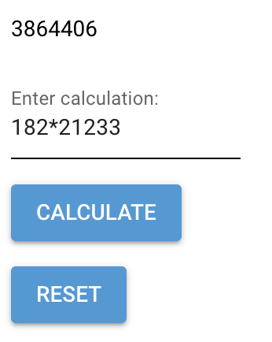

# Chat2GUI

Generate GUI through natural language on the fly!

### Demo

command: I want a simple calculator that allows text input

result:

Usage

1. Install EasyGUI. `pip install easygui`
2. `python scripts/main.py your_command`
3. `cd outputs`
4. `python main.py`
